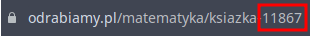

# Better Odrabiamy Downloader
Skrypt w pythonie do pobierania książek z POLSKIEJ strony Odrabiamy.pl

# Użycie
**WYMAGANE KONTO PREMIUM NA ODRABIAMY.PL ORAZ PYTHON<=3.0**

Wymagane zależności można pobrać komendą ```pip install -r requirements.txt```

Skrypt uruchamia się komendą ```python BetterOdrabiamyDownloader.py```

Skrypt zapyta się o E-mail i hasło do konta na Odrabiamy.pl, oraz ID książki które można znaleźć w linku. Przykładowe ID jest podane na załączonym poniżej obrazku



# Inspiracja

https://github.com/konrad11901/OdrabiamyDownloader

Absolwent Technikum, niewolnik Billa Gates'a. Specjalnie dla jego kupiłem komputer, oraz nauczyłem się programować, bo nie mogłem patrzć na ten kod, który nabazgrał. Jego C# jest manifestacją polskiej nadziei w Ameryce w zakresie obrony terytorialnej, oraz aktem uniżenia przed Microsoftem. Wszystkim życzymy smacznej kawusi 🥰

```pogczamp dla ciebie życzę wszystkiego najlepszego lecimy z polską linią lotniczą LOT do parku w zakopanem niestety ty nie lecisz bo kod ktoś musi naprawić elko byczq essa trzymajcie się dobre chłopaki dobry przekaz leci```
